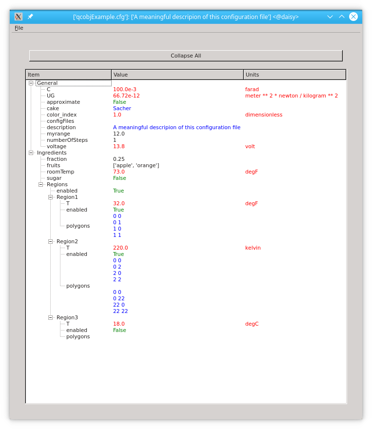
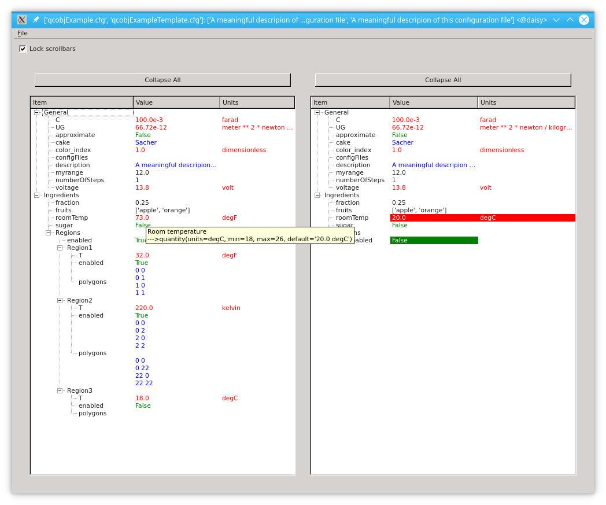
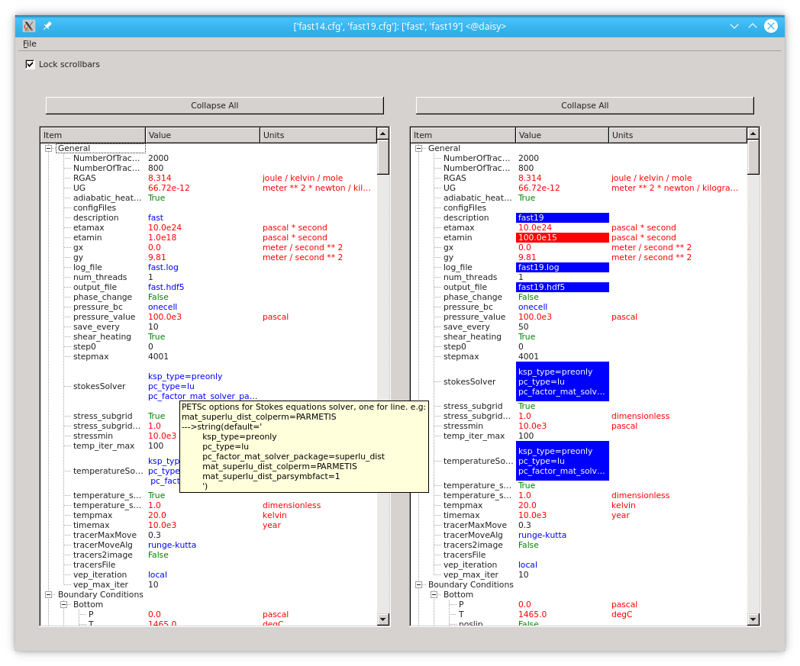

CfgGui widget
=============

CfgGui widget showing :ref:`qcobjExample`

Values are coloured according to their type:

    * Quantities: red
    * Strings: blue
    * Numbers and lists: black
    * Boolean: green

The widget can also show two (or more!) configuration files at the same time
highlighting the difference between them. This is what appears to the
user runnning the script :ref:`rungui`

The two files that appear in this snapshot are
:ref:`qcobjExample` and :ref:`qcobjExampleTemplate`.

Tooltips showing the valid quantities and range for every keyword appear when
hoovering on a value.

A real example
==============

This tool has been developed to compare large (more than one thousand lines)
configuration files like
:ref:`fast14` against :ref:`fast19`

All values displayed can be modified and their value is validated against
the configspec file that must be set when running the application.

Modified configuration files can be saved using the *File* option in the
application toolbar.
